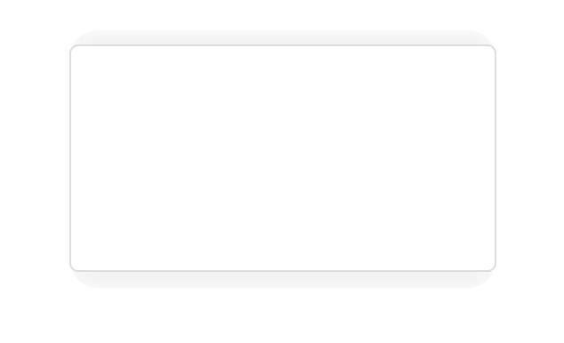

# 为 UIView 添加任意一边的阴影

和用 CALayer 的 shadowXXX 属性绘制的阴影不同，这个方法可以只绘制 UIView 任意一边的阴影，而不是 4 边阴影都绘制。如下图所示，只绘制了上下两边的阴影（当然也可以只绘制上阴影或下阴影）：

## 用法

导入头文件：#import "UIView+EdgeShadow.h"

调用该 UIView 扩展的对应方法：

1. addTopShadowColor：绘制上阴影
2. addDownShadowColor：绘制下阴影
3. addLeftShadowColor：绘制上阴影
4. addRightShadowColor：绘制下阴影